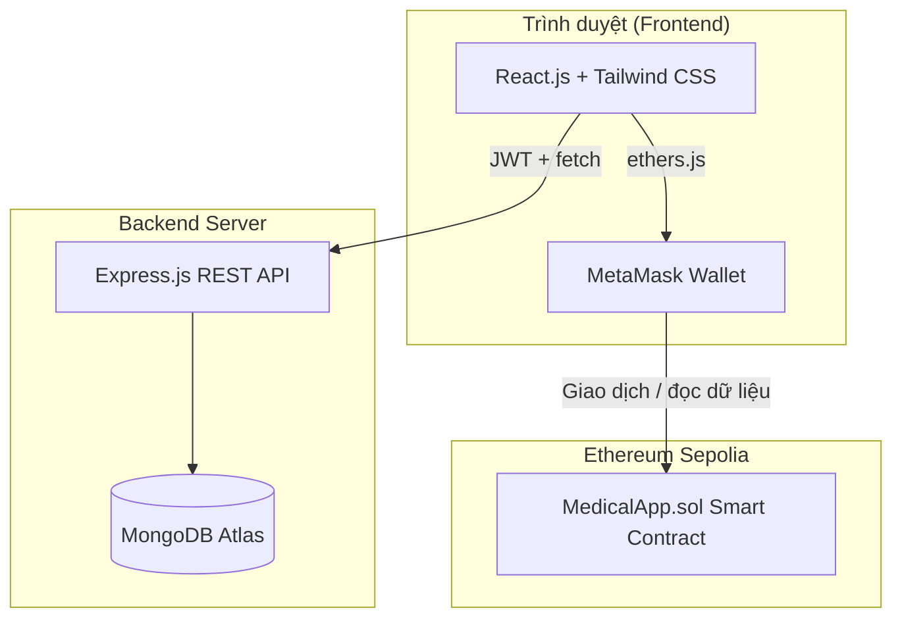
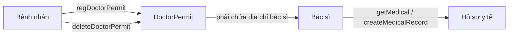
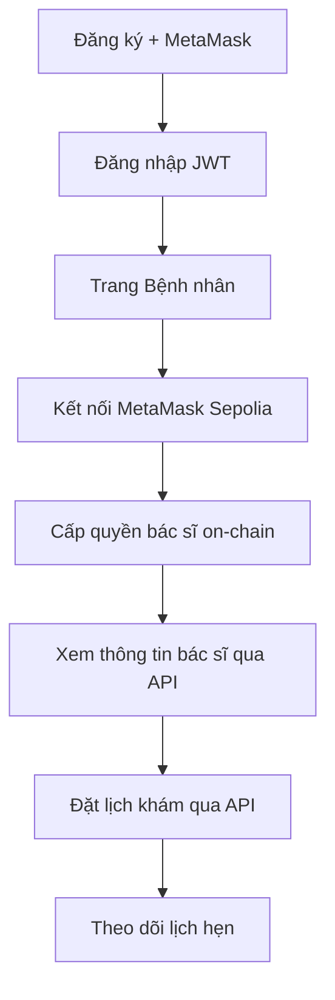
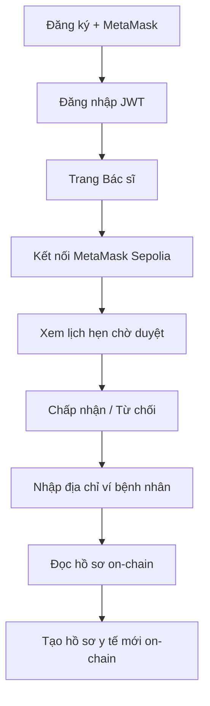

# Medical Healthcare DApp

## Đề xuất tên đề tài

**Tên chính (tiếng Việt):**
> **Xây dựng ứng dụng quản lý hồ sơ y tế phi tập trung trên nền tảng Blockchain Ethereum**

**Tên phụ / tiếng Anh:**
> *Decentralized Medical Healthcare DApp — Secure Patient Records and Doctor Access Control on Ethereum*

**Các tên thay thế có thể dùng:**
- Hệ thống lưu trữ và chia sẻ hồ sơ bệnh án điện tử dựa trên Smart Contract
- Ứng dụng Web3 quản lý y tế: Kết hợp Blockchain và cơ sở dữ liệu phân tán cho bệnh nhân và bác sĩ

---

## 1. Giới thiệu

Dự án **Medical Healthcare DApp** là một ứng dụng phi tập trung (Decentralized Application — DApp) phục vụ lĩnh vực y tế. Hệ thống cho phép **bệnh nhân** tự quản lý quyền truy cập hồ sơ y tế của mình và **bác sĩ** tạo, xem hồ sơ bệnh án khi được cấp phép — dữ liệu y tế quan trọng được lưu trữ trên **blockchain Ethereum (mạng Sepolia testnet)** thông qua Smart Contract.

Bên cạnh phần on-chain, hệ thống còn có **backend REST API** (Node.js + MongoDB) xử lý đăng ký/đăng nhập, thông tin hồ sơ người dùng và **đặt lịch khám** (off-chain). **Frontend** được xây dựng bằng React.js, kết nối MetaMask để tương tác với blockchain và gọi API backend.

### Mục tiêu dự án

- Đảm bảo tính **minh bạch** và **bất biến** của hồ sơ y tế trên blockchain
- Trao quyền kiểm soát cho **bệnh nhân** — chỉ bác sĩ được cấp phép mới xem/ghi hồ sơ
- Xây dựng giao diện web thân thiện, hỗ trợ quy trình đặt lịch khám giữa bệnh nhân và bác sĩ
- Kết hợp mô hình **hybrid**: dữ liệu nhạy cảm trên chain, dữ liệu vận hành (tài khoản, lịch hẹn) off-chain

---

## 2. Kiến trúc hệ thống



### Phân tách trách nhiệm

| Thành phần | Lưu trữ / Xử lý | Công nghệ |
|------------|-----------------|-----------|
| **Smart Contract** | Hồ sơ y tế, danh sách bác sĩ được cấp quyền | Solidity, Ethereum Sepolia |
| **Backend** | Tài khoản, thông tin cá nhân, lịch hẹn khám | Node.js, Express, MongoDB |
| **Frontend** | Giao diện người dùng, kết nối ví, gọi API & contract | React.js, ethers.js |

**Định danh chung:** Địa chỉ ví Ethereum (`walletAddress`) được dùng làm khóa liên kết giữa tài khoản off-chain và danh tính on-chain.

---

## 3. Công nghệ sử dụng

### 3.1. Frontend

| Công nghệ | Phiên bản / Ghi chú | Vai trò |
|-----------|---------------------|---------|
| React | 18.x | Framework UI |
| Create React App | react-scripts 5.0.1 | Công cụ build |
| React Router DOM | 6.x | Điều hướng trang |
| Tailwind CSS | 3.4.x | Styling |
| ethers.js | 6.x | Tương tác Smart Contract |
| MetaMask | — | Ví Web3, ký giao dịch |
| universal-cookie | 6.x | Lưu JWT |
| Font Awesome / react-icons | — | Icon |
| Three.js + Vanta | — | Hiệu ứng nền trang đăng nhập |

### 3.2. Backend

| Công nghệ | Phiên bản / Ghi chú | Vai trò |
|-----------|---------------------|---------|
| Node.js | — | Runtime |
| Express.js | 4.x | Web framework |
| MongoDB | Atlas (cloud) | Cơ sở dữ liệu |
| mongodb driver | Native driver | Truy vấn DB (không dùng Mongoose) |
| bcrypt | 5.x | Mã hóa mật khẩu |
| jsonwebtoken | 9.x | Xác thực JWT |
| cors, body-parser, dotenv | — | Middleware & cấu hình |

### 3.3. Smart Contract

| Công nghệ | Phiên bản / Ghi chú | Vai trò |
|-----------|---------------------|---------|
| Solidity | ^0.8.15 | Ngôn ngữ Smart Contract |
| Truffle | 5.11.x | Compile, test, deploy |
| OpenZeppelin Contracts | 5.x | Thư viện ERC-20 (EMedic token) |
| @truffle/hdwallet-provider | — | Deploy lên Sepolia |
| Mạng triển khai | Sepolia testnet | Blockchain thử nghiệm |

### 3.4. Triển khai (Deployment)

- **Frontend & Backend:** Hỗ trợ deploy qua Vercel (`vercel.json`)
- **Smart Contract:** Deploy thủ công hoặc qua Truffle lên Sepolia
- **Địa chỉ contract đang dùng:** `0xE0f9fD6a5C6062f115224328cFB6e017839F8FA7` (MedicalApp)

---

## 4. Cấu trúc thư mục dự án

```
Medical-Healthcare-Dapp/
│
├── frontend/                          # Ứng dụng web React
│   ├── public/
│   │   ├── index.html
│   │   └── manifest.json
│   ├── src/
│   │   ├── components/
│   │   │   ├── CustomModal.jsx        # Modal thông báo "đang phát triển"
│   │   │   ├── Navbar.jsx             # Thanh điều hướng sidebar
│   │   │   ├── ProtectedRoutes.jsx    # Bảo vệ route bằng JWT cookie
│   │   │   └── SidebarData.jsx        # Menu theo vai trò (bệnh nhân/bác sĩ)
│   │   ├── pages/
│   │   │   ├── LoginPage/             # Đăng nhập
│   │   │   ├── RegisterPage/          # Đăng ký (patient / doctor)
│   │   │   ├── PatientPage/           # Trang bệnh nhân
│   │   │   ├── DoctorPage/            # Trang bác sĩ
│   │   │   ├── AppointmentPage/       # Quản lý lịch hẹn (bệnh nhân)
│   │   │   ├── Home.jsx               # (chưa sử dụng)
│   │   │   └── NoPage.jsx             # Trang 404
│   │   ├── config.js                  # Địa chỉ Smart Contract
│   │   ├── MedicalApp.json            # ABI + bytecode contract
│   │   ├── index.js                   # Entry point + routing
│   │   └── index.css                  # Tailwind + font tùy chỉnh
│   ├── package.json
│   ├── tailwind.config.js
│   └── vercel.json
│
├── backend/                           # REST API server
│   ├── configs/
│   │   ├── middleware.js              # Xác thực JWT
│   │   └── database-init.js           # Tạo collection & index khi khởi động
│   ├── Controller/
│   │   ├── authController.js          # Đăng ký, đăng nhập
│   │   ├── appointmentController.js   # CRUD lịch hẹn
│   │   ├── doctorController.js        # Tra cứu thông tin bác sĩ
│   │   └── debugController.js         # API debug (dev)
│   ├── Models/
│   │   ├── userModel.js               # Schema mô tả Doctor / Patient
│   │   └── appointmentModel.js        # Schema mô tả Appointment
│   ├── Routes/
│   │   ├── authRoutes.js
│   │   ├── appointmentRoutes.js
│   │   ├── doctorRoutes.js
│   │   └── debugRoutes.js
│   ├── index.js                       # Entry point Express
│   ├── database.js                    # Kết nối MongoDB
│   ├── package.json
│   ├── ARCHITECTURE.md                # Tài liệu kiến trúc nội bộ
│   └── vercel.json
│
├── smart_contract/                    # Smart Contract Ethereum
│   ├── contracts/
│   │   ├── MedicalApp.sol             # Contract chính — hồ sơ y tế & phân quyền
│   │   └── EMedic.sol                 # Token ERC-20 (dự kiến tương lai)
│   ├── build/contracts/               # Artifact sau khi compile (ABI, bytecode)
│   ├── truffle-config.js              # Cấu hình mạng Sepolia, compiler
│   ├── package.json
│   └── .env                           # PRIVATE_KEY, RPC_URL (không commit)
│
└── README.md                          # Tài liệu dự án (file này)
```

---

## 5. Vai trò người dùng

Hệ thống có **hai vai trò** chính:

| Vai trò | Mô tả |
|---------|-------|
| **Bệnh nhân (Patient)** | Quản lý quyền truy cập hồ sơ, xem thông tin bác sĩ, đặt lịch khám |
| **Bác sĩ (Doctor)** | Xem/tạo hồ sơ y tế (khi được cấp quyền), duyệt lịch hẹn khám |

Không có vai trò quản trị viên (admin) trong phiên bản hiện tại.

---

## 6. Tính năng chi tiết

### 6.1. Tính năng chung

- **Đăng ký tài khoản:** Bệnh nhân hoặc bác sĩ đăng ký qua form, bắt buộc kết nối MetaMask để lấy địa chỉ ví
- **Đăng nhập:** Xác thực email/mật khẩu, nhận JWT (thời hạn 15 phút), lưu trong cookie
- **Bảo vệ route:** Các trang nội bộ yêu cầu JWT hợp lệ và đúng `userType`
- **Kết nối MetaMask:** Kiểm tra mạng Sepolia trước khi gọi Smart Contract
- **Giao diện tiếng Việt:** Nhãn và thông báo chủ yếu bằng tiếng Việt

### 6.2. Tính năng Bệnh nhân

| Tính năng | Lưu trữ | Mô tả |
|-----------|---------|-------|
| Cấp quyền cho bác sĩ | On-chain | Gọi `regDoctorPermit` — thêm địa chỉ ví bác sĩ vào danh sách được phép |
| Thu hồi quyền bác sĩ | On-chain | Gọi `deleteDoctorPermit` — xóa bác sĩ khỏi danh sách |
| Xem danh sách bác sĩ được cấp quyền | On-chain | Gọi `showDoctorPermit` |
| Xem thông tin bác sĩ | Off-chain | API `/doctor-info/:doctorAddress` |
| Đặt lịch khám | Off-chain | Gửi ngày, giờ, lý do khám qua API |
| Theo dõi lịch hẹn | Off-chain | Xem trạng thái Pending / Accepted / Rejected |

### 6.3. Tính năng Bác sĩ

| Tính năng | Lưu trữ | Mô tả |
|-----------|---------|-------|
| Xem lịch hẹn chờ duyệt | Off-chain | API `/appointments/doctor` |
| Chấp nhận / Từ chối lịch hẹn | Off-chain | API `PUT /appointments/:id/status` |
| Tra cứu hồ sơ bệnh nhân | On-chain | Gọi `getMedical` — chỉ khi bệnh nhân đã cấp quyền |
| Tạo hồ sơ y tế mới | On-chain | Gọi `createMedicalRecord` — ghi ngày giờ và nội dung khám |

### 6.4. Các trang đang phát triển

Một số mục trên sidebar (Dashboard, Thuốc, Hồ sơ, Bệnh nhân, Đơn thuốc, Chat, Cài đặt) hiện hiển thị modal *"Các trang khác vẫn đang được phát triển"*.

---

## 7. Smart Contract — MedicalApp.sol

### 7.1. Cấu trúc dữ liệu

```solidity
struct MedicalRecord {
    string datetime;   // Ngày giờ khám
    string info;       // Nội dung hồ sơ / chẩn đoán
}

struct Patients {
    MedicalRecord[] medicalRecords;   // Danh sách hồ sơ y tế
    address[] DoctorPermit;           // Danh sách bác sĩ được cấp quyền
}

mapping(address => Patients) patients;  // Key: địa chỉ ví bệnh nhân
```

### 7.2. Các hàm chính

| Hàm | Người gọi | Loại | Mô tả |
|-----|-----------|------|-------|
| `getMedical(patient_address)` | Bác sĩ | view | Trả về hồ sơ y tế nếu bác sĩ có trong `DoctorPermit` |
| `createMedicalRecord(patient, datetime, info)` | Bác sĩ | write | Thêm hồ sơ mới (cần được cấp quyền trước) |
| `regDoctorPermit(doctor_address)` | Bệnh nhân | payable | Cấp quyền cho bác sĩ; có thể gửi kèm ETH |
| `showDoctorPermit()` | Bệnh nhân | view | Trả về danh sách địa chỉ bác sĩ được cấp quyền |
| `deleteDoctorPermit(doctor_address)` | Bệnh nhân | write | Thu hồi quyền truy cập của bác sĩ |

### 7.3. Mô hình phân quyền



- Bệnh nhân **hoàn toàn kiểm soát** ai được xem/ghi hồ sơ của mình
- Không có đăng ký vai trò on-chain — quyền được xác định qua danh sách `DoctorPermit`
- Dữ liệu hồ sơ lưu dạng **plaintext** trên blockchain (chưa mã hóa / IPFS)

### 7.4. Contract phụ — EMedic.sol

Token ERC-20 (`EMedic` / `EMEDIC`) với nguồn cung ban đầu 1.000.000 token, dự kiến dùng cho thanh toán và quản lý lịch hẹn trong tương lai. **Chưa tích hợp** vào frontend/backend.

---

## 8. API Backend

**Base URL:** `http://localhost:8080` (mặc định) hoặc `REACT_APP_API_URL` khi deploy.

| Method | Endpoint | Xác thực | Mô tả |
|--------|----------|----------|-------|
| `GET` | `/` | Không | Health check |
| `POST` | `/register` | Không | Đăng ký bác sĩ hoặc bệnh nhân |
| `POST` | `/login` | Không | Đăng nhập, trả về JWT |
| `GET` | `/auth-endpoint` | JWT | Kiểm tra token, trả về `userType` + `userData` |
| `POST` | `/appointments` | JWT | Bệnh nhân tạo lịch hẹn |
| `GET` | `/appointments/patient` | JWT | Bệnh nhân xem lịch hẹn của mình |
| `GET` | `/appointments/doctor` | JWT | Bác sĩ xem lịch hẹn |
| `PUT` | `/appointments/:id/status` | JWT | Bác sĩ cập nhật trạng thái (Accepted/Rejected) |
| `GET` | `/doctor-info/:doctorAddress` | Không | Tra cứu thông tin bác sĩ theo ví |
| `GET` | `/debug/doctors` | Không | Liệt kê bác sĩ (dev) |
| `GET` | `/debug/search-doctor` | Không | Tìm bác sĩ theo email/ví/tên (dev) |

### Collections MongoDB

| Collection | Nội dung chính |
|------------|----------------|
| `doctor` | Tên, email, bệnh viện, khoa, chuyên khoa, số đăng ký, ví |
| `patient` | Tên, email, tuổi, giới tính, SĐT, địa chỉ, CMND/CCCD, ví |
| `appointments` | Địa chỉ bệnh nhân/bác sĩ, ngày, giờ, lý do, trạng thái |

---

## 9. Luồng hoạt động

### 9.1. Luồng Bệnh nhân



### 9.2. Luồng Bác sĩ



### 9.3. Các route Frontend

| Route | Quyền truy cập | Trang |
|-------|----------------|-------|
| `/` | Công khai | Đăng nhập |
| `/register/:userType` | Công khai | Đăng ký (`patient` hoặc `doctor`) |
| `/patient` | Bệnh nhân | Quản lý quyền bác sĩ, đặt lịch |
| `/appointments` | Bệnh nhân | Danh sách lịch hẹn |
| `/doctor` | Bác sĩ | Duyệt lịch hẹn, hồ sơ y tế |
| `*` | Công khai | Trang 404 |

---

## 10. Hướng dẫn cài đặt và chạy

### 10.1. Yêu cầu

- Node.js (v16+)
- MongoDB Atlas (hoặc MongoDB local)
- MetaMask extension trên trình duyệt
- Tài khoản Infura/Alchemy (RPC Sepolia) — cho deploy contract
- Sepolia ETH (faucet) — cho giao dịch on-chain

### 10.2. Smart Contract

```bash
cd smart_contract
npm install
# Tạo file .env với PRIVATE_KEY và RPC_URL
npm run compile
npm run migrate -- --network sepolia
```

### 10.3. Backend

```bash
cd backend
npm install
# Tạo file .env: DB_CONNECTION_KEY, PORT, ACCESS_TOKEN_SECRET, CLIENT_URL
npm run devStart
```

Server chạy mặc định tại `http://localhost:8080`.

### 10.4. Frontend

```bash
cd frontend
npm install
# Tạo file .env: REACT_APP_API_URL=http://localhost:8080
# Cập nhật địa chỉ contract trong src/config.js nếu deploy mới
npm start
```

Ứng dụng chạy tại `http://localhost:3000`.

---

## 11. Hạn chế hiện tại

- Hồ sơ y tế lưu **dạng văn bản thuần** trên blockchain, chưa mã hóa end-to-end
- Chi phí gas khi ghi/đọc dữ liệu on-chain
- Lịch hẹn khám lưu off-chain, chưa được xác minh trên blockchain
- Token EMedic chưa được tích hợp
- Một số trang UI còn placeholder
- Backend không xác minh chữ ký ví — chỉ lưu địa chỉ do người dùng cung cấp

---

## 12. Hướng phát triển tương lai

- **Quản lý lịch hẹn on-chain** với token ERC-20 (EMedic) cho thanh toán/phí khám
- **Tự động tạo PDF** hồ sơ y tế khi bác sĩ ghi bệnh án, lưu hash trên blockchain
- **Mã hóa dữ liệu** trước khi lưu on-chain hoặc dùng IPFS + hash on-chain
- **Cải thiện UI/UX** — hoàn thiện các trang Dashboard, Chat, Đơn thuốc
- **Đăng nhập Google OAuth** (đã có code nền, chưa bật)
- **Unit test** cho Smart Contract và API
- **Migration scripts** Truffle đầy đủ trong repository

---

## 13. Tóm tắt cho báo cáo đồ án

| Hạng mục | Nội dung |
|----------|----------|
| **Lĩnh vực** | Y tế số, Blockchain, Web3 |
| **Loại hình** | DApp lai (Hybrid DApp) |
| **Blockchain** | Ethereum Sepolia Testnet |
| **Smart Contract** | MedicalApp.sol — phân quyền & hồ sơ y tế |
| **Backend** | REST API Node.js + MongoDB |
| **Frontend** | React.js SPA + MetaMask |
| **Đối tượng sử dụng** | Bệnh nhân, Bác sĩ |
| **Đóng góp chính** | Mô hình bệnh nhân làm chủ dữ liệu y tế; kết hợp on-chain/off-chain cho hồ sơ bệnh án và đặt lịch khám |

---

*Tài liệu được tổng hợp từ mã nguồn dự án Medical-Healthcare-Dapp — phục vụ báo cáo đồ án tốt nghiệp.*
